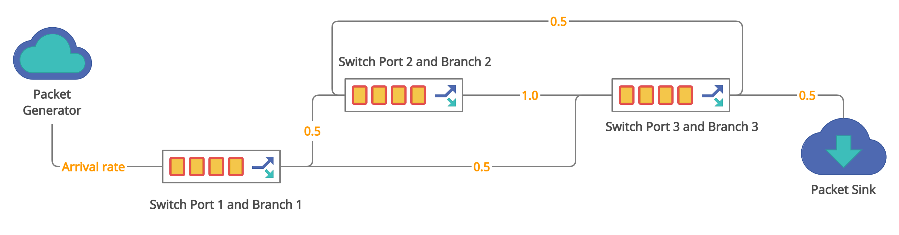

# QueuingNetworkEvaluation
We want to research to several models involve Python coding environ- ment as well
as concepts such as queueing simulation, algorithms simulation,... In this project is to implement
an environment in order to simulating the queuing network with some M/M/1 queueing system. In
the previous assignment we studied how to evaluate performance system through the theory, this
time we will create the simulation, or specifically Discrete Event Simulation (DES) by using SimPy
package.

# Goal and system definition
In order to understand how a queuing network works, we need a tool that can simulate the entire
process of the system and also record the necessary metrics for evaluation. This model should be
detailed, objective and highly symbolic.
To reach that, SimPy - a Python package provides Processes to model active components such as
messages, customers, trucks, and planes. It has three classes to model facilities where congestion
might occur: Resources for ordinary queues, Levels for the supply of quantities of material, and
Stores for collections of individual items.
Besides, we also used SimComponent - a precompiled source-code used to describe an object-
oriented system; they include objects such as PacketSink, Packet, PacketGenerator, SwitchPort,
... along with its associated properties and methods.
In experimental design, we want to observe and analyze how the average waiting time of a packet
in process and the occupancy of queues change respect to the change of arrival rate.
# Definition system
Data processing is one of the inevitable needs of almost all systems from the most basic to the
most complex; The processing must be based on preset criteria to suit the needs of users as well
as to make the process more efficient. Open queueing network is a system modelled by networked
queues in which a job departing from one queue arrives at another queue. Open queueing network
has external arrivals and departures and possesses the following characteristics:

• Number of jobs in system varies with time.

• Assumed that throughput equals to arrival time.

• The analysis goal of this queueing network is to characterize the distribution of number of
jobs in the system.
The Jackson networked queueing is one of the data processing methods widely used in the service
industries and e-commerce. This type of queueing has external arrivals and departures (Open
queueing network), which satisfies that:

• Any external arrivals to node i form a Poisson process.

• The service time is exponentially distributed and the service discipline is First Come First
Served (FCFS).

• A job after finished at queue i, either moves to queue j with probability pij, or leaves the
system with probability

• Utilization of all queues < 1.
Before heading to main features of the project, we will look again at the requirements of the given
project a network of 3 queues Q1 = M/M(μ1)/1, Q2 = M/M(μ2)/1, Q3 = M/M(μ3)/1, in which
Q1 → Q2 with p12 = 0.5, Q1 → Q3 with p13 = 0.5, Q2 → Q3 with p23 = 1.0, Q3 → Q1 with
p31 = 0.5, arrival process to Q1 with λ, jobs after going through Q3 will leave the network with
the probability of 0.5.
With boundary, this system follow some assumptions:

• Service rate (bps) and packet size (s), is fixed at some certain exponential distributions.

• Probability of a packet going out from switch port 1 get into queue 2 or queue 3.

• All cases are simulated on a specific version of SimPy and its environment.

• All parameters are simulated on a specific version of random library

   
 
The components of our simulator design contains:

• Packet Generator: A Packet Generator simulates the sending of packets with a specified
inter-arrival time distribution (second) and a specified packet size (byte).

• Switch Port: Models a switch output port containing a queue with a processor that process
packets waiting in the queue with a service rate (bits per second).

• Packet Sink: Receives packets and collects delay information into the waits[] list.

• Port Monitor: A monitor for an SwitchPort. Looks at the number of items in the SwitchPort
in service + in the queue and records that info in the sizes[] list for every a specific time
interval.
# Simulation
Read file ipynb file.
# Conclusion
We have built a simulation environment and the queueing system using SimPy and ran it for
8000 times to observe and analyze how the average waiting time of a packet in process and the
occupancy of queues change respect to the change of arrival time for a whole system as well as
calculation for each queue. After doing some experiments using visualization data to plot them,
we can see the trends of the system and get the average results, find steady of the system.
Based on some theories and then calculation through them we have some comparisons between what
we expected and what we got as following: The result in the simulation is approximately calculation
in analysis theory about constraints are needed to keep stability of the queuing network(with
λ1, λ2, λ3 respectively). In addition , we have already found that which queue of the network are
bottleneck through the utilization of each Switch Port with ρ1, ρ2, ρ3 and then we can say that
queue 3 is bottleneck and with the result in the simulation we can see what are the same between
them by average occupancy in Switch Port3. However, our simulation has drawbacks when we
cannot find average waiting time for each queue(Switch Port), we need to improve the method in
the future because it is necessary to demonstrate more details about the system.
